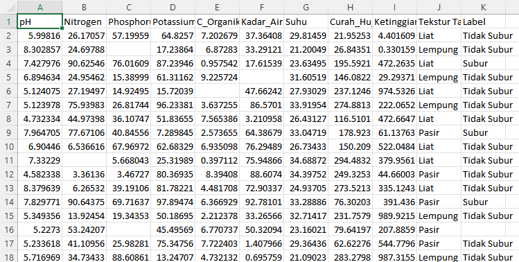

# UTS-PENDATA
## Analisa Data Kesuburan Tanah 

code yang berfungsi untuk membuat, membersihkan, dan mengevaluasi model Machine Learning K-Nearest Neighbors (KNN) untuk klasifikasi 'Kesuburan Tanah'.

## 1. Pembuatan Dataset (2000 Data)

Dataset sintetis dibuat dengan 2000 baris data yang mencakup berbagai parameter tanah. Label 'Subur' atau 'Tidak Subur' ditentukan berdasarkan kondisi pH, Nitrogen, dan Fosfor tertentu.

```python
np.random.seed(42)

n = 2000

data = {
    'pH': np.random.uniform(4.5, 8.5, n),
    'Nitrogen': np.random.uniform(0, 100, n),
    'Phosphorus': np.random.uniform(0, 100, n),
    'Potassium': np.random.uniform(0, 100, n),
    'C_Organik': np.random.uniform(0, 10, n),
    'Kadar_Air': np.random.uniform(0, 100, n),
    'Suhu': np.random.uniform(20, 35, n),
    'Curah_Hujan': np.random.uniform(0, 300, n),
    'Ketinggian': np.random.uniform(0, 1000, n),
    'Tekstur Tanah': np.random.choice(['Liat', 'Pasir', 'Lempung'], n)
}

df = pd.DataFrame(data)

df['Label'] = np.where(
    (df['pH'] > 5.5) &
    (df['Nitrogen'] > 40) &
    (df['Phosphorus'] > 40),
    'Subur',
    'Tidak Subur'
)
```

## 2. Penambahan Missing Value

Untuk mensimulasikan data, sekitar 5% data di dataset diubah menjadi `np.nan` (Not a Number) secara acak.

```python
for col in df.columns:
    df.loc[df.sample(frac=0.05).index, col] = np.nan
```

## 3. Penyimpanan Data Mentah

Dataset dengan missing value ini disimpan sebagai `dataset_tanah_raw.csv`.

```python
df.to_csv("dataset_tanah_raw.csv", index=False)
```

## 4. Preprocessing Data

Langkah-langkah pembersihan dan persiapan data meliputi:

*   **Penanganan Missing Value:** Missing value pada kolom numerik diisi dengan nilai median. Untuk kolom kategorikal 'Tekstur Tanah' dan 'Label', missing value diisi dengan mode (nilai yang paling sering muncul).
*   **Encoding Kategorikal:** Kolom 'Tekstur Tanah' diubah dari teks menjadi angka menggunakan `LabelEncoder` agar dapat diproses oleh model.

```python
# Handle Missing Values
df.fillna(df.median(numeric_only=True), inplace=True)
df['Tekstur Tanah'].fillna(df['Tekstur Tanah'].mode()[0], inplace=True)
df['Label'].fillna(df['Label'].mode()[0], inplace=True)

# Encoding
le = LabelEncoder()
df['Tekstur Tanah'] = le.fit_transform(df['Tekstur Tanah'])
```

## 5. Penyimpanan Data Bersih

Dataset yang sudah bersih dan terproses disimpan sebagai `dataset_tanah_clean.csv`.

```python
df.to_csv("dataset_tanah_clean.csv", index=False)
```

## 6. Pembagian dan Skala Data

Dataset dibagi menjadi fitur (`X`) dan target (`y`). Fitur `X` kemudian dinormalisasi menggunakan `StandardScaler`. Setelah itu, data dibagi menjadi set pelatihan (80%) dan pengujian (20%).

```python
X = df.drop('Label', axis=1)
y = df['Label']

scaler = StandardScaler()
X = scaler.fit_transform(X)

X_train, X_test, y_train, y_test = train_test_split(
    X, y, test_size=0.2, random_state=42
)
```

## 7. Pelatihan Model KNN

Model K-Nearest Neighbors (KNN) dengan `n_neighbors=5` dilatih menggunakan data pelatihan.

```python
knn = KNeighborsClassifier(n_neighbors=5)
knn.fit(X_train, y_train)

y_pred = knn.predict(X_test)
```

## 8. Evaluasi Model

Model dievaluasi menggunakan metrik Akurasi, Presisi, Recall, dan F1-Score pada data pengujian. Hasil evaluasi memberikan gambaran kinerja model.

```python
accuracy = accuracy_score(y_test, y_pred)
precision = precision_score(y_test, y_pred, pos_label='Subur')
recall = recall_score(y_test, y_pred, pos_label='Subur')
f1 = f1_score(y_test, y_pred, pos_label='Subur')

print("=== HASIL EVALUASI MODEL KNN ===")
print("Accuracy :", round(accuracy, 4))
print("Precision:", round(precision, 4))
print("Recall   :", round(recall, 4))
print("F1-Score :", round(f1, 4))
```

### Hasil Evaluasi Model KNN:

```text
=== HASIL EVALUASI MODEL KNN ===
Accuracy : 0.845
Precision: 0.6944
Recall   : 0.7212
F1-Score : 0.7075
```


## Hasil Akhir



## 9. Pengunduhan File

Pada akhirnya, file `dataset_tanah_raw.csv` dan `dataset_tanah_clean.csv` diunduh ke sistem lokal Anda.

```python
from google.colab import files
files.download("dataset_tanah_raw.csv")
files.download("dataset_tanah_clean.csv")
```
