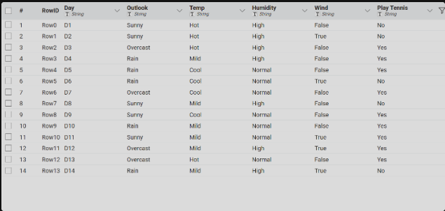
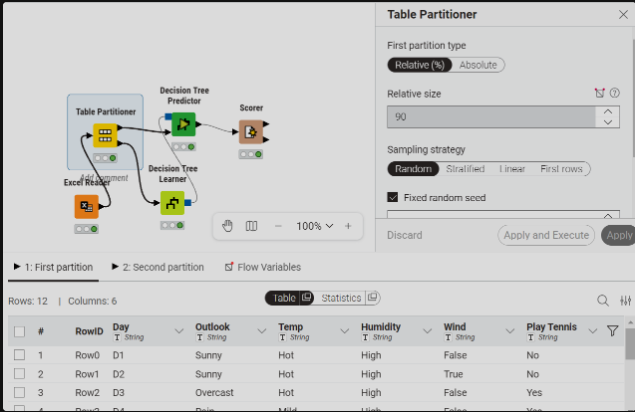
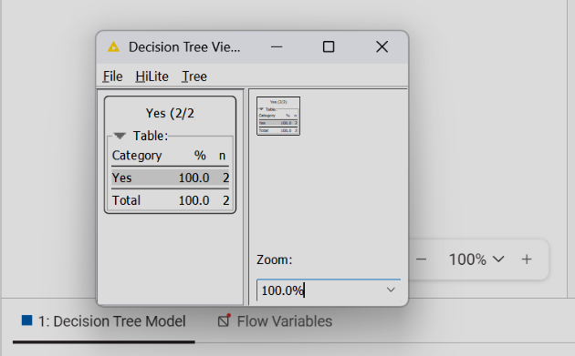
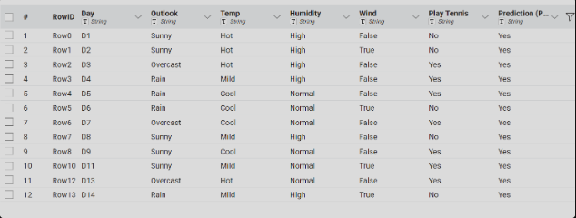
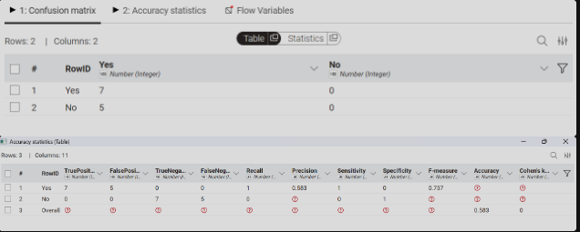

#  Decision Tree

##  Pengertian Decision Tree

---

## Decision Tree

Decision tree (pohon keputusan) adalah algoritma supervised learning berbentuk struktur pohon yang memodelkan serangkaian keputusan dan kemungkinan hasilnya untuk tujuan klasifikasi atau regresi. Alat ini memecah data kompleks menjadi himpunan bagian lebih kecil, memudahkan visualisasi, analisis risiko, dan pengambilan keputusan berdasarkan aturan jika-maka (if-then)

Algoritma ini bekerja dengan membentuk struktur seperti pohon, di mana setiap cabang merepresentasikan keputusan berdasarkan kondisi tertentu.

Dalam Decision Tree, terdapat beberapa komponen utama:

* **Root Node**
  Node awal yang menjadi dasar pembentukan pohon.

* **Decision Node**
  Node yang berisi kondisi atau aturan untuk membagi data.

* **Leaf Node**
  Node akhir yang berisi hasil keputusan atau kelas.

---

## Metode dalam Decision Tree

Decision Tree biasanya menggunakan metode berikut untuk menentukan pembagian data terbaik:

* **Gini Index**
* **Information Gain**

Metode ini digunakan untuk memilih atribut terbaik dalam melakukan *split* data pada setiap node.

---

## Langkah-langkah Decision Tree di KNIME

Berikut langkah-langkah membuat dan menampilkan Decision Tree menggunakan **KNIME Analytics Platform**:

### 1. Import Data

Gunakan node seperti:

* CSV Reader
* Excel Reader

Untuk memasukkan dataset ke dalam KNIME.

---

### 2. Partitioning Data

Gunakan node **Partitioning** untuk membagi data menjadi:

* **Data Training** (90%)
* **Data Testing** (10%)

---

### 3. Membuat Model

Tambahkan node **Decision Tree Learner**, lalu:

* Pilih kolom target (kelas)
* Pilih metode (Gini Index / Information Gain)

---

### 4. Menampilkan Decision Tree

Setelah node dijalankan:

* Klik kanan pada node **Decision Tree Learner**
* Pilih **"View: Decision Tree"**

---

### 5. Prediksi Data

Gunakan node **Decision Tree Predictor** untuk menguji model menggunakan data testing.

---

### 6. Evaluasi Model

Gunakan node **Scorer** untuk melihat hasil evaluasi, seperti:

* Accuracy
* Precision
* Recall

---

##  Kesimpulan

Decision Tree merupakan metode yang mudah dipahami karena berbentuk struktur pohon dengan aturan keputusan yang jelas.

Dengan menggunakan KNIME, proses pembuatan model menjadi lebih sederhana karena:

* Tidak memerlukan coding
* Hanya perlu menyusun workflow

---

